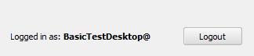

If everything went well, at the bottom of the **Boundless Connect** panel,
you should see your email and a button to **Logout**.

You are now ready to search for Boundless Connect content.

This step ends the lesson, click **Finish Lesson**.