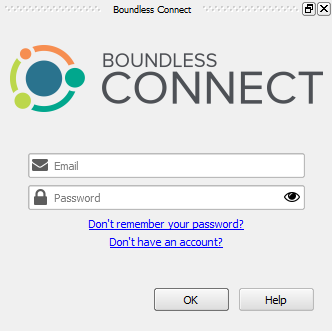
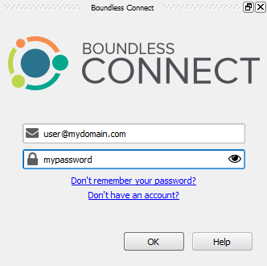

# 01_introduction

The **Boundless Connect** plugin allows you to browse, visualize and download 
Boundless Connect Portal content from within QGIS. Before you use it, you 
should login using your Boundless Connect credentials to have full access 
to the content.

If this is the first time you enter any authentication credentials in QGIS, 
it's likely that you have to set QGIS Master Password in the process.

This lesson will walk you trough the login process and Master Password setting.

Click **Next Step** when you are ready to start.

#### 02_enable_boundless_connect_panel

Make sure the **Boundless Connect** panel is visible.

If not, enable it using the **Plugins > Boundless Connect** menu item.

When you are done, click **Next Step**.

#### 03_enter_username_and_password

In **Boundless Connect** panel, type in the **Email** address and **Password**
you have used in Boundless Connect Portal in the corresponding fields.

Then, click **OK**.

**Note:** If you don't have a *Boundless Connect* account, click the **Don't
have an account link?** to get one. It's free!

When you are done, click **Next Step**.

#### 04_set_master_password

If you haven’t done it before, QGIS will ask you to set a *Master Password*. The
*Master Password* is used to protect all your credentials inside QGIS, for
example, username and passwords for connecting to spatial databases.
 
Choose your master password wisely and make sure you memorize it, as the master
password is not retrievable. Type in the password twice and click **OK**.

If you already have set a master password, you may be asked to enter it
to unlock QGIS’s authentication database and save your Boundless Connect
credentials in it. In that case, type your master password and click **OK**

If neither of the dialogs shows up, then you can safely skip this step, as it
seems that you have already provided your master password.

When you are done, click **Next Step**.

#### 05_confirm_login

If everything went well, at the bottom of the **Boundless Connect** panel, 
you should see your email and a button to **Logout**.

 
You are now ready to search for Boundless Connect content.

This step ends the lesson, click **Finish Lesson**.