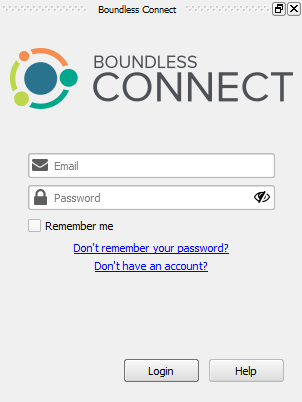

Make sure the **Boundless Connect** panel is visible.

If not, enable it using the **Plugins > Boundless Connect** menu item.

Since, by default, both Lessons and Boundless Connect panels are docked on the
right side of the screen, I suggest you to move one of them to the other side of
the screen, which will make ifollowing the lesson easier.

When you are done, click **Next Step**.