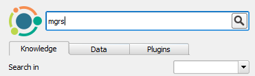
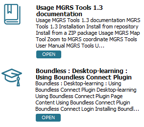

After the login, the **Boundless Connect** panel shows a search field and some
tabs. By default, the **Knowledge** tab is visible. This tab can be used to
search for knowledge-based content like Product documentation, Tutorials from
the learning center, Questions and Answers, Blog posts, and interactive lessons
for QGIS.

1. In the search field, type *MGRS* and press **Enter** or click the magnifying
glass icon.

    

2. The search results will be listed below. Each result shows an icon, a title,
   and a description of the corresponding resource.

    

When you are done, click **Next Step**.