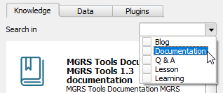

As seen before, searching in the **Knowledge** tab returns resources from
different categories. You can narrow down the results using the **Search for**
drop-down list to filter the categories you want to search.

1. Click the widget down arrow to expand the categories.

    

2. From the list of categories, select the **Documentation** checkbox.

    

3. Now, click the magnifying glass icon again to re-run the search.

    

Now, your search should only return resources from the documentation
category.

**Note:** You can search several categories, by enabling more than one category.

When you are done, click **Next Step**.