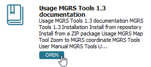
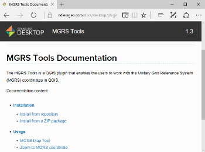

Depending on the resources category, different actions can be performed with it.
In the **Knowledge** tab, apart from the Lessons (that can be downloaded and
installed), all other resources will open in your default browser.

1. From the list of results, click the **Open** button  under the *MGRS
Tools Documentation MGRS Tools 1.3 documentation* result.

    

This action will open your default browser with the requested documentation page.

When you are done, click **Next Step**.