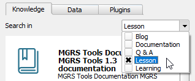

Under any of the tabs, it is possible to list all available resources by
clicking the **Search** icon (or pressing `Enter` on your keyboard)
without entering any keyword.

In the **Knowledge** tab searching without a keyword will return
thousands of results, which may end up being useless. On the other hand
if you filter the search using the filter categories, then it makes sense.
For example, selecting the *Lessons* category only, will list all
lessons available.

1. Click the widget down arrow to expand the categories.

    

2. From the list of categories, deselect the **Documentation** checkbox
   and select **Lessons** instead.

    

3. Now, delete the `mgrs` keyword form the search field, and click the
   magnifying glass icon again to re-run the search.

    

Now, your search should return all lessons groups available.

You can click the **Install** button underneath each result to install
the lessons.

When you are done, click **Next Step**.