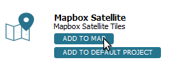

Data layer resources can be added to the current QGIS project.

1. Below the *Mapbox Satellite* resource, click the **Add to map** button.

    

The layer will load in QGIS layers panel and map canvas.

When you are done, click **Next Step**.