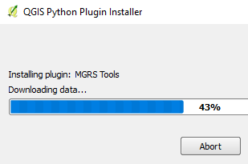

You can install plugins directly from the list of results.

1. Click the **Install** button below *MGRS Tools* result.

    

The plugin will be downloaded and installed.

**Note:** Depending on your Boundless Connect subscription, its possible that
some of the resources action buttons are red ins

This step ends the lesson, click **Finish Lesson**.