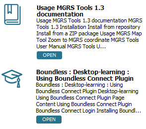
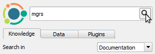
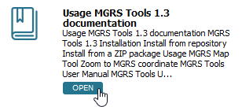

# 01_introduction

The **Boundless Connect** plugin allows you to browse, visualize and download
Boundless Connect Portal content from within QGIS. Before you use it, you
should login using your Boundless Connect credentials to have full access
to the content.

If this is the first time you enter any authentication credentials in QGIS,
it's likely that you have to set QGIS Master Password in the process.

This lesson will walk you trough the login process and Master Password setting.

Click **Next Step** when you are ready to start.

#### 02_enable_boundless_connect_panel

Make sure the **Boundless Connect** panel is visible.

If not, enable it using the **Plugins > Boundless Connect** menu item.

When you are done, click **Next Step**.

#### 03_enter_username_and_password

In **Boundless Connect** panel, type in the **Email** address and **Password**
you have used in Boundless Connect Portal in the corresponding fields.

Then, click **OK**.

**Note:** If you don't have a *Boundless Connect* account, click the **Don't
have an account link?** to get one. It's free!

When you are done, click **Next Step**.

#### 04_set_master_password

If you haven’t done it before, QGIS will ask you to set a *Master Password*. The
*Master Password* is used to protect all your credentials inside QGIS, for
example, username and passwords for connecting to spatial databases.

Choose your master password wisely and make sure you memorize it, as the master
password is not retrievable. Type in the password twice and click **OK**.

If you already have set a master password, you may be asked to enter it
to unlock QGIS’s authentication database and save your Boundless Connect
credentials in it. In that case, type your master password and click **OK**

If neither of the dialogs shows up, then you can safely skip this step, as it
seems that you have already provided your master password.

When you are done, click **Next Step**.

#### 05_confirm_login

If everything went well, at the bottom of the **Boundless Connect** panel,
you should see your email and a button to **Logout**.

You are now ready to search for Boundless Connect content.

This step ends the lesson, click **Finish Lesson**.

#### 06_searching_for_knowledge_content

After the login, the **Boundless Connect** panel shows a search field and some
tabs. By default, the **Knowledge** tab is visible. This tab can be used to
search for knowledge-based content like Product documentation, Tutorials from
the learning center, Questions and Answers, Blog posts, and interactive lessons
for QGIS.

1. In the search field, type *MGRS* and press **Enter** or click the magnifying
glass icon.

   

2. The search results will be listed below. Each result shows an icon, a title,
   and a description of the corresponding resource.

   

When you are done, click **Next Step**.

#### 07_filter_knowledge_results

As seen before, searching in the **Knowledge** tab returns resources from
different categories. You can narrow down the results using the **Search for**
drop-down list to filter the categories you want to search.

1. Click the widget down arrow to expand the categories.

   

2. From the list of categories, select the **Documentation** checkbox.

   

3. Now, click the magnifying glass icon again to re-run the search.

   

Now, your search should only return resources from the documentation
category.

**Note:** You can search several categories, by enabling more than one category.

When you are done, click **Next Step**.

#### 08_open_knowledge_resources

Depending on the resources category, different actions can be performed with it.
In the **Knowledge** tab, apart from the Lessons (that can be downloaded and
installed), all other resources will open in your default browser.

1. From the list of results, click the **Documentation** button  under the *MGRS
Tools Documentation MGRS Tools 1.3 documentation* result.

   

This action will open your default browser with the requested documentation page.

When you are done, click **Next Step**.

#### 09_search_for_data

The **Data** tab can be used to search for datasets hosted or curated by
Boundless or available from one of our partners.

1. Click the **Data** tab.

2. In the search field, type *mapbox* and press **Enter** or click the magnifying
glass icon.

   

   A list of available mapbox data resources will show.

   

When you are done, click **Next Step**.

#### 10_add_data_to_map

Data layer resources can be added to the current QGIS project.

1. Below the *Mapbox Satellite* resource, click the **Add to map** button.

   

The layer will load in QGIS layers panel and map canvas.

When you are done, click **Next Step**.

#### 11_add_data_to_default_project

Data layer resources can also be added as basemaps in QGIS default project. That
way,  any time you start a new project in QGIS, the layer will be loaded by default.

1. Below the *Mapbox Light* resource, click the **Add to default project** button.

   

2. From menus, click **Project > New** or press `Ctrl+N` to open a new project.

3. In the **Save?** dialog, click **Discard**.

The new project will open, and you will be able to confirm that the Mapbox Light
layer is loaded.

   

   

**Note:** You can revert this setting going to **Settings > Options** and,
in the **General** tab, reset the default project clicking **Reset default**.
You can also replace your default project by the one loaded in QGIS by clicking
**Set current project as default*.

When you are done, click **Next Step**.

#### 12_search_for_plugins

The **Plugins** tab can be used to search for Boundless Plugins for QGIS. For
each result, there will be a button that allows you to easily download and
install the plugin.

1. Click the **Plugins** tab.

2. In the search field, for example, type *qgis* and press **Enter** or click
the magnifying glass icon.

   

   A list of available plugins will show.

   

When you are done, click **Next Step**.

#### 13_install_plugins

You can install plugins directly from the list of results.

1. Click the **Install** button below MGRS Tools result.

   

   The plugin will be downloaded and installed.

   

This step ends the lesson, click **Finish Lesson**.