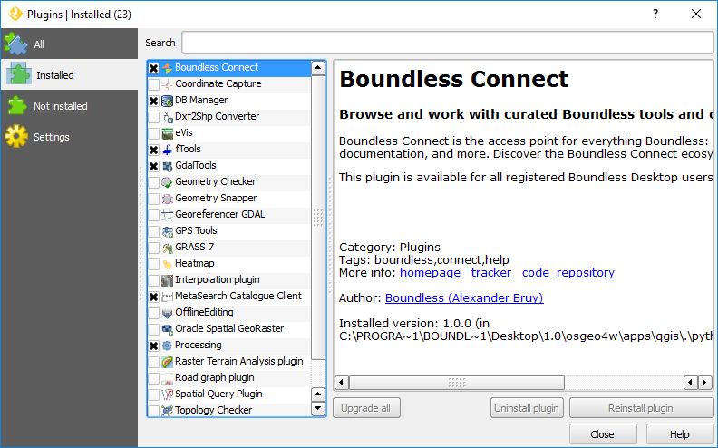

Installation
============

The |connect_plugin| is a core plugin in |BLQGIS|'s QGIS and does not need to be installed. If, at some point, you can't see either the |connect_plugin|'s panel or it's menu entries, make sure it's activated.

Go to :menuselection:`Plugins --> Manage and Install Plugins`, and in the :guilabel:`Installed` tab make sure the plugin's checkbox is enabled.

