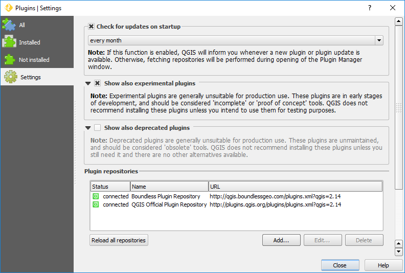

.. _install-plugins:

Plugins installation
--------------------

|connect_plugin| adds two extra plugin sources that can be used to install
plugins besides the usual online remote repository. Therefore, depending on
your configuration, you can install plugins in several different ways:

* :ref:`from-remote-repository`
* :ref:`from-local-repository` (available with |connect_plugin| only)
* :ref:`from-zip-package` (available with |connect_plugin| only)

.. _from-remote-repository:

From a remote plugin repository
...............................

This is the most common way to install plugins, whether from QGIS's Official
Plugins Repository, Boundless QGIS Plugins Repository or any other remote
repository that you may have configured, using QGIS's *Plugin Manager* directly
in :menuselection:`Plugins --> Manage and Install Plugins...`

In the particular case of the remote *Boundless QGIS Plugin Repository*, it will
be necessary to provide credentials to access the repository fully. Therefore,
make sure to login as described in :ref:`connect-login`. These can also be set
manually in QGIS *Plugin Manager* settings.

For more information on how to use *Plugin Manager*, please refer to the
following tutorial on `Working with QGIS plugins
<https://learning-center.boundlessgeo.com/desktop/quickstart/working_with_qgis_plugins/index.html>`_.

For more information on *Boundless QGIS Plugin Repository*, please see its
`documentation
<https://connect.boundlessgeo.com/docs/desktop/latest/plugins/plugin_repo.html>`_

.. _from-local-repository:

From a local repository
.......................

Using |connect_plugin|, it's possible to use a local path or network path as a
repository (see :ref:`configure-repository-location` section for details on how
to set a local repository). This can be useful in cases of limited or inexistent
internet access or to provide a curated list of plugins for your company.

If any repository is set that way, the |connect_plugin| will add a menu item in
:menuselection:`Plugins --> plugins (local folder)`. This tool can be used when
you want to install plugins from a local (directory-based) repository. The usage
is similar to the *Plugin Manager*.

To activate, deactivate, or uninstall plugins from a local repository, you can
use the *Plugin Manager* or the *Manage plugins (local folder)*.

.. Note::

   Since the QGIS *Plugin Manager* does not support directory-based repositories
   yet, when you uninstall a plugin, previously installed from the local
   directory-based repository, the following warning will be shown.

   .. figure:: img/plugin-uninstall.png
      :align: center

   This warning can be safely ignored since you can install or uninstalled the
   plugin again using :menuselection:`Plugins --> Manage plugins (local folder)`
   menu item.

.. _from-zip-package:

From a plugin ZIP package
.........................

If you have a plugin package (e.g. previously downloaded from any repository or
packaged by yourself from sources) you can easily install it using the
|connect_plugin|, without the need to unpack it. Go to :menuselection:`Plugins
--> Install plugin from ZIP`, browse to the directory with plugin zip package
and select the corresponding file. If the zip file is a valid QGIS plugin
package, it is installed and activated.

To deactivate or remove plugins installed this way, you can use QGIS *Plugin
Manager* from :menuselection:`Plugins --> Manage and Install Plugins...` menu
item.

.. _managing-plugins:

Managing plugins
----------------

All plugins added by |connect_plugin| can be deactivated, uninstalled or updated
using QGIS *Plugin Manager*. You can access it via the :menuselection:`Plugins
--> Manage and Install Plugins...` menu item.

.. figure:: img/managing-plugins.png
   :align: center

   Plugin Manager

Beside the plugins installed by the user, if previously configured by the system
administrator, |connect_plugin| will install additional predefined plugins (see
:ref:`add-additional-plugins` section for more details about it).

.. _updating-plugins:

Updating plugins
----------------

By default, |connect_plugin| configure QGIS to check plugin updates every month.
This check is performed on QGIS start, and if updates are found, you will see a
corresponding message in QGIS status bar:

.. figure:: img/update-available.png
   :align: center

   Plugin update available

Clicking this message will open QGIS *Plugin Manager*, where you can select
which plugins to update.

.. note::

   When the *Check for updates* is activated, you will be requested to enter
   your master password after QGIS start. This is necessary to provide the
   credentials to check updates in *Boundless Plugins Repository*.

If you don't want to be notified about plugin updates or want to check for
updates more frequently, open *Plugin Manager* from :menuselection:`Plugins -->
Manage and Install Plugins...` menu, go to the :guilabel:`Settings` tab and edit
options.

   Configuring check for updates