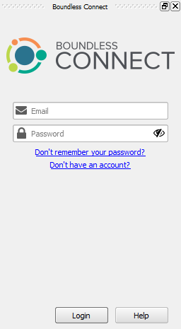
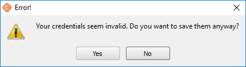
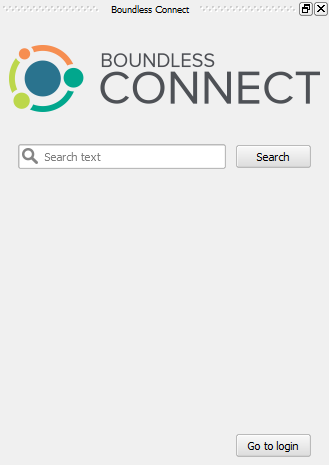
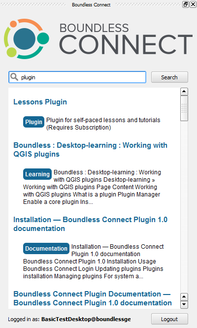
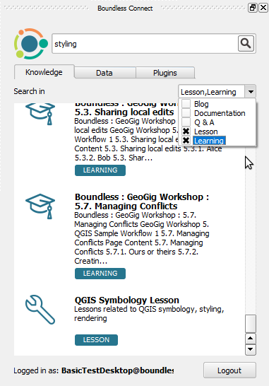
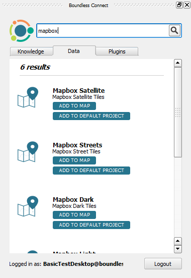
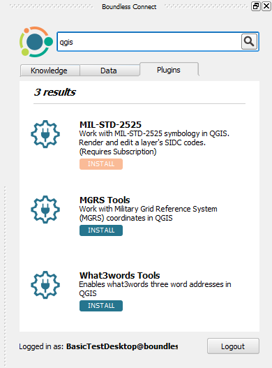

Usage
=====

.. _connect-tool:

The :guilabel:`Boundless Connect` panel will automatically open when |BLQGIS|'s
QGIS starts for the first time.

   Boundless Connect Panel with Login

.. note::

   If at the time, you don't want to enter your credentials and search for
   Boundless Connect resources, you can safely close it. You can open it again
   later clicking :menuselection:`Plugins --> Boundless Connect` or
   :menuselection:`View --> Panels --> Plugins --> Boundless Connect` menu
   items.

.. _connect-login:

Boundless Connect Login
-----------------------

If you want to install Boundless plugins from the remote *Boundless QGIS Plugin
Repository* or search and access `Boundless Connect
<https://connect.boundlessgeo.com/>`_ additional resources, you will need to
enter `Boundless Connect <https://connect.boundlessgeo.com/>`_ credentials in
the :guilabel:`email` and :guilabel:`password` fields, and press
:guilabel:`Login`.

After pressing the :guilabel:`Login` button, |connect_plugin| will try to
validate your credentials in Boundless Connect portal (internet connection is
needed). If the credentials are valid, it will save them in QGIS's
authentication encrypted database, so that you don't have to enter them again.

.. note::

   If you haven't done this before, QGIS will ask you to set a **master
   password**. The *master password* is used to protect all your credentials
   inside QGIS, for example, usernames and passwords for connecting to spatial
   databases. Choose your master password wisely and make sure you memorize it,
   as **the master password is not retrievable**. Press :guilabel:`OK` to
   complete the process.

   .. figure:: img/add-master-password.png
      :align: center

      Setting QGIS master authentication password

   If you already have a master password, you will be asked to enter it to be
   able to unlock QGIS's authentication database and save your *Boundless
   Connect* credentials in it.

   .. figure:: img/enter-master-password.png
      :align: center

      Entering QGIS master authentication password

If the credentials are invalid (unknown email or wrong password), you will see
a message dialog, asking you what to do.

* Press :guilabel:`No` to enter valid credentials and try again
* Press :guilabel:`Yes` to use/save the invalid credentials

   Message about invalid credentials

If |BLQGIS| is configured to use a local directory-based repository (check this
with your system administrator), you can leave :guilabel:`Email` and
:guilabel:`Password` fields empty. Press :guilabel:`Login` to continue. (In this
case, you won't be asked for a master password.)

Setting default basemaps
........................

After the first successful login, a message box will pop up asking *Would you
like to add Boundless basemap to your default project?*. If you choose
**[Yes]**, the **Mapbox Street** basemap is added to your default
project. After this, every time you open a new project it will contain the
Mapbox basemap layer.

You can revert this setting in going to :menuselection:`Settings -->
Options` and, in the :guilabel:`General` tab, reset the default project clicking
:guilabel:`Reset default`. You can also replace your default project by the
one loaded in QGIS by clicking :guilabel:`Set current project as default`

Check :ref:`connect-data-tab` to see how to add other basemap layers to your
default project.

.. _connect-search:

Searching Boundless Connect
---------------------------

After the login, the
:guilabel:`Boundless Connect` panel will show a :guilabel:`Search` field which
can be used to search for Plugins, Data and Knowledge content from Boundless
Connect.

   Boundless Connect Search

Under the search field, there are three tabs which allow you to choose the
type content to search for: :guilabel:`Knowledge`, :guilabel:`Data`, and
:guilabel:`Plugins`.

At the bottom of the :guilabel:`Boundless Connect` panel, you can find the
user's email you have logged with and a :guilabel:`Logout` button (clicking the
:guilabel:`Logout` button will return you to the login page where you can enter
new credentials).

To search for Boundless Connect content, select the appropriate tab, type some
text in the field and click the :guilabel:`Search` icon (or press :kbd:`Enter`
on your keyboard).

   Search results

At the top of the results list, is shown the number of results. Each item of
the search results will show an icon, a title and a description
about it. There will also be some buttons that, depending on the type of
resource found, will allow different actions. See the next sub-sections for
more details.

.. note::

   You will note that some resources buttons are red (instead of blue). That
   means your Boundless Connect subscription level is lower than what is
   required for accessing that resource, clicking it will point you to the
   subscription page in Boundless Connect, where you can upgrade your
   subscription.

   .. figure:: img/resource_needs_higher_subscription.png

      Resource needs a higher subscription level

Knowledge tab
.............

The :guilabel:`Knowledge` tab can be used to search resources related to
knowledge about Boundless Products, including Product Documentation, Product
Learning centers tutorials, Questions & Answers, Blog posts and Lessons
for QGIS Lesson plugin.

When in the :guilabel:`Knowledge` tab, under the search field there is a
drop-down list of the available categories from where you can select
the ones you are interested in searching from. When no category is selected,
the search runs through all categories.

Under each result, there is a button that informs the category of the resource.
Clicking it will perform a different action depending on the resource type.
For lessons resources, it will download and install the lesson (you will
need to `Lesson plugin <https://connect.boundlessgeo
.com/docs/desktop/plugins/lessons/>`_ installed to use them). For other
knowledge resources,
like Documentation or Learning Center online content, it will open it in your
default web browser.

.. note::

   **Learning**, **Q&A**, and **Blogs** resources will require you to enter
   your Boundless Connect credential again in your browser.

   .. figure:: img/enter_credentials_in_learning_center.png

.. _connect-data-tab:

Data tab
........

The :guilabel:`Data` tab can be used to search for datasets hosted or indexed
by Boundless or available from one of our partners. For each result there
will be two action buttons available:

* :guilabel:`Add to map` - Adds the  dataset to the current QGIS project.
* :guilabel:`Add to default project` - Adds the layer to the bottom of your QGIS
  default project. This project will be used as a base for when you create a new
  project.

Plugins tab
...........

The :guilabel:`Plugins` tab can be used to search for Boundless Plugins for
QGIS. For each result, there will be a button that allows you to
download and install the plugin easily.

.. note::

   You can also install Boundless plugins in the usual way by opening QGIS
   *Plugin Manager* from :menuselection:`Plugins --> Manage and install plugins`
   and entering "Boundless" in the filter field in the top of the *Plugin
   Manager* dialog.