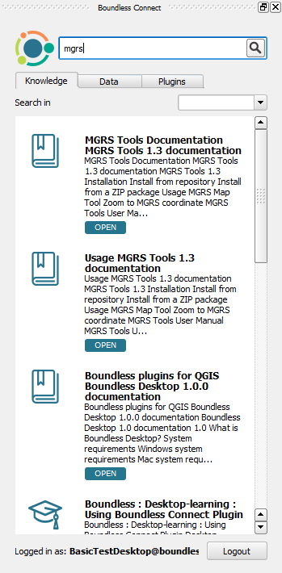

Usage
=====

.. _connect-tool:

Boundless Connect Panel
-----------------------

The :guilabel:`Boundless Connect` Panel will automatically open when QGIS is started for the first time with the |connect_plugin| activated.

.. figure:: img/connect-dock.png
   :align: center

   Boundless Connect Panel with Login

.. note::

   If at the time, you don't want to enter your credentials and search for plugins or additional resources, you can safely close it. You can open it again later going to :menuselection:`Plugins --> Boundless Connect` or :menuselection:`View --> Panels --> Plugins --> Boundless Connect` menu items.

If your organization works with the remote *Boundless QGIS Plugin Repository* and you want to install Boundless plugins, or if you want to search and access `Boundless Connect <https://connect.boundlessgeo.com/>`_ resources, you will need to enter `Boundless Connect <https://connect.boundlessgeo.com/>`_
credentials in the :guilabel:`email` and :guilabel:`password` fields, and press :guilabel:`Login`.

After pressing the :guilabel:`Login` button, |connect_plugin| will try to validate your credentials in Boundless Connect portal (internet connection is needed).
If the credentials are valid, it will save them in QGIS's authentication database.

.. note::

   If you haven't done this before, QGIS will ask you to set a **master password**.
   The *master password* is used to protect all your credentials inside QGIS,
   for example, usernames and passwords for connecting to spatial databases. Choose
   your master password wisely and make sure you memorize it, as **the master
   password is not retrievable**. Press :guilabel:`OK` to complete the process.

   .. figure:: img/add-master-password.png
      :align: center

      Setting QGIS master authentication password

   If you already have a master password, you will be asked to enter it to be able to unlock
   QGIS's authentication database and save your *Boundless Connect* credentials in it.

   .. figure:: img/enter-master-password.png
      :align: center

      Entering QGIS master authentication password

If the credentials are invalid (unknown email or wrong password), you will see
a message dialog, asking you what to do.

* Press :guilabel:`No` to enter valid credentials and try again
* Press :guilabel:`Yes` to use/save the invalid credentials

.. figure:: img/invalid-credentials.png
   :align: center

   Message about invalid credentials

You can also skip entering your credentials, by pressing :guilabel:`Login` without filling the :guilabel:`Email` and :guilabel:`Password` fields.

.. note::

   Even with no credentials or invalid ones, you will be able to use |connect_plugin| and even
   perform search in the Boundless Connect portal. You will also be able to download plugins
   and other resources that don't require authentication. But, if you try to download protected
   plugins, you will be asked for valid credentials.

If the |connect_plugin| was configured to use a local directory-based
repository (check this with your system administrator), you can leave
:guilabel:`Email` and :guilabel:`Password` fields empty. Press :guilabel:`Login`
to continue. (In this case you won't be asked for a master password.)

After entering the *Boundless Connect* credentials or just by pressing :guilabel:`Login`
without entering anything in the fields, you will see search panel which will
be used to search and access Boundless plugins and other additional content.

.. figure:: img/search-panel.png
   :align: center

   Boundless Connect Search.

At the bottom of the search panel you can find information about your subscription
level and :guilabel:`Sign out` button. Clicking on :guilabel:`Sign out` button will
return you to the login page where you can enter another credentials.

.. note::

   Credentials you entered in the login dialog will be used also for accessing
   *Boundless Plugins Repository*.

To get any content, you need type some text in the :guilabel:`Search` field and press
``Enter`` button on your keyboard.

   Search results

Each item has title and description. Description also contains tags, and information
about subscription level, required to access this item. Clicking on the item title
will open web browser with content or install corresponding plugin.

If your subscription level is lower that required, you will be redirected to the
subscription page.

.. note::

   Boundless plugins also can be installed in the usual way by opening QGIS
   *Plugin Manager* from :menuselection:`Plugins --> Manage and install plugins`
   and entering "Boundless" in the filter field in the top of the *Plugin Manager*
   dialog.

.. _updating-plugins:

Updating plugins
----------------

By default |connect_plugin| configure QGIS to check plugin updates every month.
This check performed on QGIS start, and if updates found, you will see
corresponding message in QGIS status bar

.. figure:: img/update-available.png
   :align: center

   Plugin update available

Clicking on this message will open QGIS *Plugin Manager*, where you can select
which plugins to update.

.. note::

   When the *Check for updates* is activated, you will be requested to enter
   your master password after QGIS start. This is necessary to check updates in
   *Boundless Plugins Repository*.

If you don't want be notified about plugin updates or want check for updates
more frequently, open *Plugin Manager* from
:menuselection:`Plugins --> Manage and Install Plugins...` menu, go to the
:guilabel:`Settings` tab and edit options.

.. figure:: img/check-updates.png
   :align: center

   Configuring check for updates

Plugins installation
--------------------

Using |connect_plugin|, plugin installation can be performed in several
different ways:

* :ref:`from-remote-repository`
* :ref:`from-local-repository` (through |connect_plugin| only)
* :ref:`from-zip-package` (through |connect_plugin| only)

.. _from-remote-repository:

From a remote plugin repository
...............................

This is the most common way to install plugins, whether from QGIS Official
Plugins Repository, Boundless QGIS Plugins Repository or any other remote
repository that you may have configured, using the *Plugin Manager* directly.

.. note::

   If your organization works with the remote *Boundless QGIS Plugin Repository*
   it will be necessary to provide credentials to fully access the repository.
   This can be done using the :ref:`connect-tool` as described above or
   setting them manually using the QGIS *Plugin Manager* settings.

.. _from-local-repository:

From a local repository
.......................

Using |connect_plugin| it's possible to use a local path or network path as
a repository (see :ref:`configure-repository-location` section for details on
how to set a local repository). If any repository was set that way, the
|connect_plugin| will add an additional menu item in :menuselection:`Plugins`
named :guilabel:`Manage plugins (local folder)`. This tool should be used when
the user wants to install plugins from a local (directory-based) repository.
The usage is similar to the *Plugin Manager*.

To active, deactivate or uninstall plugins from a local repository, either the
*Plugin Manager* or the *Manage plugins (local folder)* tool can be used.

.. Note::

   Since the QGIS *Plugin Manager* does not support directory-based repositories
   yet, when you uninstall a plugin, previously installed from Boundless local
   directory-based repository, the following warning will be shown.

   .. figure:: img/plugin-uninstall.png
      :align: center

   This warning can be safely ignored, as you can install or uninstalled the
   plugin again using :menuselection:`Plugins --> Manage plugins (local folder)`
   menu item.

.. _from-zip-package:

From a plugin ZIP package
.........................

If you have a plugin package (e.g. previously downloaded from any repository or
GitHub) you can easily install it using the |connect_plugin|, without the need
to unpack it. Go to :menuselection:`Plugins --> Install plugin from ZIP`,
browse to the directory with plugin zip package and select the corresponding
file. If the zip file is a valid QGIS plugin package it will be installed and
activated.

To deactivate or remove plugins installed this way, like before, one can use
QGIS *Plugin Manager* from :menuselection:`Plugins --> Manage and Install Plugins...`
menu item.

.. _managing-plugins:

Managing plugins
----------------

All plugins added by |connect_plugin| can be deactivated, uninstalled or
updated using QGIS *Plugin Manager*. You can access it via the
:menuselection:`Plugins --> Manage and Install Plugins...` menu item.

   Plugin Manager

Beside the plugins installed by the user, if previously configured by the system
administrator, |connect_plugin| will install additional predefined plugins (see
:ref:`add-additional-plugins` section for more details about it).
