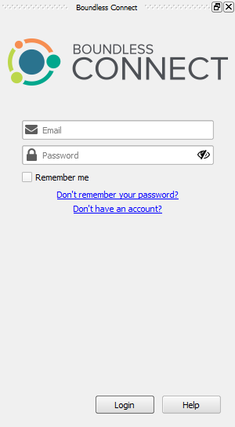
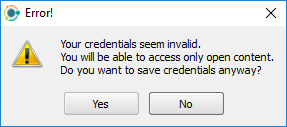
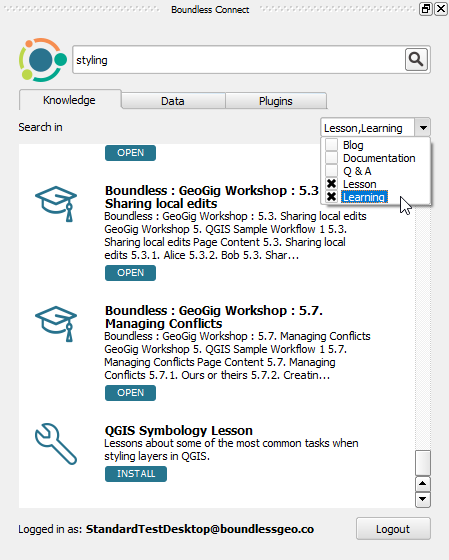

Usage
=====

.. _connect-tool:

The :guilabel:`Boundless Connect` panel will automatically open when |BLQGIS|'s
QGIS starts for the first time.

   Boundless Connect Panel with Login

.. note::

   If at the time, you don't want to enter your credentials and search for Boundless Connect resources, you can safely close it. You can open it again later clicking :menuselection:`Plugins --> Boundless Connect` or :menuselection:`View --> Panels --> Plugins --> Boundless Connect` menu items.

.. _connect-login:

Boundless Connect Login
-----------------------

If you want to install Boundless plugins from the remote *Boundless QGIS Plugin Repository* or search and access `Boundless Connect <https://connect.boundlessgeo.com/>`_ additional resources, you will need to enter `Boundless Connect <https://connect.boundlessgeo.com/>`_ credentials in the :guilabel:`email` and :guilabel:`password` fields, and press :guilabel:`Login`.

After pressing the :guilabel:`Login` button, |connect_plugin| will try to validate your credentials in Boundless Connect portal (internet connection is needed).
If the credentials are valid, it will save them in QGIS's authentication encrypted database, so that you don't have to enter them again.

.. note::

   If you haven't done this before, QGIS will ask you to set a **master password**.
   The *master password* is used to protect all your credentials inside QGIS,
   for example, usernames and passwords for connecting to spatial databases. Choose
   your master password wisely and make sure you memorize it, as **the master
   password is not retrievable**. Press :guilabel:`OK` to complete the process.

   .. figure:: img/add-master-password.png
      :align: center

      Setting QGIS master authentication password

   If you already have a master password, you will be asked to enter it to be able to unlock
   QGIS's authentication database and save your *Boundless Connect* credentials in it.

   .. figure:: img/enter-master-password.png
      :align: center

      Entering QGIS master authentication password

If the credentials are invalid (unknown email or wrong password), you will see
a message dialog, asking you what to do.

* Press :guilabel:`No` to enter valid credentials and try again
* Press :guilabel:`Yes` to use/save the invalid credentials

   Message about invalid credentials

You can also skip entering your credentials, by pressing :guilabel:`Login` without filling the :guilabel:`Email` and :guilabel:`Password` fields.

.. note::

   Even with no credentials or invalid ones, you will be able to use |connect_plugin| and even
   perform a search in the Boundless Connect portal. You will also be able to download plugins
   and other resources that don't require authentication. But, if you try to download protected
   plugins or access resources behind authentication, you will be asked for valid credentials.

If |BLQGIS| is configured to use a local directory-based repository (check this with your system administrator), you can leave
:guilabel:`Email` and :guilabel:`Password` fields empty. Press :guilabel:`Login` to continue. (In this case, you won't be asked for a master password.)

Setting default basemaps
........................

After the first successful login, a message box will pop up asking *Would you
like to add Boundless basemap to your default project?*. If you choose
**[Yes]**, the **Mapbox Street** basemap is added to your default
project. After this, every time you open a new project it will contain the
Mapbox basemap layer.

You can revert this setting in going to :menuselection:`Settings -->
Options` and, in the :guilabel:`General` tab, reset the default project clicking
:guilabel:`Reset default`. You can also replace your default project by the
one loaded in QGIS by clicking :guilabel:`Set current project as default`

Check :ref:`connect-data-tab` to see how to add other basemap layers to your
default project.

.. _connect-search:

Searching Boundless Connect
---------------------------

After the login (either by entering your credentials or skipping it), the :guilabel:`Boundless Connect` panel will show a :guilabel:`Search` field which can be used to search for Plugins, Data and Knowledge content from Boundless Connect.

.. figure:: img/search-panel.png
   :align: center

   Boundless Connect Search

Under the search field, there are three tabs which allow you to choose the
type content to search for: :guilabel:`Knowledge`, :guilabel:`Data`, and
:guilabel:`Plugins`.

At the bottom of the :guilabel:`Boundless Connect` panel, you can find the user's email you have logged with and a :guilabel:`Logout` button (clicking the :guilabel:`Logout` button will return you to the login page where you can enter new credentials).

To search for Boundless Connect content, select the appropriate tab, type some
text in the field and click the :guilabel:`Search` icon (or press :kbd:`Enter`
on your keyboard).

.. figure:: img/search-results.png
   :align: center

   Search results

At the top of the results list, is shown the number of results. Each item of
the search results will show an icon, a title and a description
about it. There will also be some buttons that, depending on the type of
resource found, will allow different actions. See the next sub-sections for
more details.

.. note::

   You will note that some resources buttons are red (instead of blue). That
   means your Boundless Connect subscription level is lower than what is
   required for accessing that resource, clicking it will point you to the
   subscription page in Boundless Connect, where you can upgrade your
   subscription.

   .. figure:: img/resource_needs_higher_subscription.png

      Resource needs a higher subscription level

Knowledge tab
.............

The :guilabel:`Knowledge` tab can be used to search resources related to
knowledge about Boundless Products, including Product Documentation, Product
Learning centers tutorials, Questions & Answers, Blog posts and Lessons
for QGIS Lesson plugin.

When in the :guilabel:`Knowledge` tab, under the search field there is a
drop-down list of the available categories from where you can select
the ones you are interested in searching from. Note that "All" category includes
all other categories, so if you enable it, there is no need to choose
any other category.

Under each result, there is a button that informs the category of the resource.
Clicking it will perform a different action depending on the resource type.
For lessons resources, it will download and install the lesson (you will
need to `Lesson plugin <https://connect.boundlessgeo
.com/docs/desktop/plugins/lessons/>`_ installed to use them). For other
knowledge resources,
like Documentation or Learning Center online content, it will open it in your
default web browser.

.. note::

   **Learning**, **Q&A**, and **Blogs** resources will require you to enter
   your Boundless Connect credential again in your browser.

   .. figure:: img/enter_credentials_in_learning_center.png

.. _connect-data-tab:

Data tab
........

The :guilabel:`Data` tab can be used to search for datasets hosted or indexed
by Boundless or available from one of our partners. For each result there
will be two action buttons available:

* :guilabel:`Add to map` - Adds the  dataset to the current QGIS project.
* :guilabel:`Add to default project` - Adds the layer to the bottom of your QGIS
  default project. This project will be used as a base for when you create a new
  project.

.. figure:: img/data_tab.png

Plugins tab
...........

The :guilabel:`Plugins` tab can be used to search for Boundless Plugins for
QGIS. For each result, there will be a button that allow you to
download and install the plugin easily.

.. figure:: img/plugin_tab.png

.. note::

   You can also install Boundless plugins in the usual way by opening QGIS *Plugin Manager* from :menuselection:`Plugins --> Manage and install plugins` and entering "Boundless" in the filter field in the top of the *Plugin Manager* dialog.

.. _install-plugins:

Plugins installation
--------------------

|connect_plugin| adds two extra plugin sources that can be used to install
plugins besides the usual online remote repository. Therefore, depending on
your configuration, you can install plugins in several different ways:

* :ref:`from-remote-repository`
* :ref:`from-local-repository` (available with |connect_plugin| only)
* :ref:`from-zip-package` (available with |connect_plugin| only)

.. _from-remote-repository:

From a remote plugin repository
...............................

This is the most common way to install plugins, whether from QGIS's Official Plugins Repository, Boundless QGIS Plugins Repository or any other remote repository that you may have configured, using QGIS's *Plugin Manager* directly in :menuselection:`Plugins --> Manage and Install Plugins...`

In the particular case of the remote *Boundless QGIS Plugin Repository*, it will be necessary to provide credentials to access the repository fully. Therefore, make sure to login as described in :ref:`connect-login`. These can also be set manually in QGIS *Plugin Manager* settings.

For more information on how to use *Plugin Manager*, please refer to the following tutorial on `Working with QGIS plugins <https://learning-center.boundlessgeo.com/desktop/quickstart/working_with_qgis_plugins/index.html>`_.

For more information on *Boundless QGIS Plugin Repository*, please see its `documentation <https://connect.boundlessgeo.com/docs/desktop/latest/plugins/plugin_repo.html>`_

.. _from-local-repository:

From a local repository
.......................

Using |connect_plugin|, it's possible to use a local path or network path as a repository (see :ref:`configure-repository-location` section for details on how to set a local repository). This can be useful in cases of limited or inexistent internet access or to provide a curated list of plugins for your company.

If any repository is set that way, the |connect_plugin| will add a menu item in :menuselection:`Plugins --> plugins (local folder)`. This tool can be used when you want to install plugins from a local (directory-based) repository. The usage is similar to the *Plugin Manager*.

To activate, deactivate, or uninstall plugins from a local repository, you can use the *Plugin Manager* or the *Manage plugins (local folder)*.

.. Note::

   Since the QGIS *Plugin Manager* does not support directory-based repositories yet, when you uninstall a plugin, previously installed from the local directory-based repository, the following warning will be shown.

   .. figure:: img/plugin-uninstall.png
      :align: center

   This warning can be safely ignored since you can install or uninstalled the plugin again using :menuselection:`Plugins --> Manage plugins (local folder)` menu item.

.. _from-zip-package:

From a plugin ZIP package
.........................

If you have a plugin package (e.g. previously downloaded from any repository
or packaged by yourself from sources) you can easily install it using
the |connect_plugin|, without the need to unpack it. Go to :menuselection:`Plugins --> Install plugin from ZIP`, browse to the directory with plugin zip package and select the corresponding file. If the zip file is a valid QGIS plugin package, it is installed and activated.

To deactivate or remove plugins installed this way, you can use QGIS *Plugin Manager* from :menuselection:`Plugins --> Manage and Install Plugins...` menu item.

.. _managing-plugins:

Managing plugins
----------------

All plugins added by |connect_plugin| can be deactivated, uninstalled or updated using QGIS *Plugin Manager*. You can access it via the :menuselection:`Plugins --> Manage and Install Plugins...` menu item.

.. figure:: img/managing-plugins.png
   :align: center

   Plugin Manager

Beside the plugins installed by the user, if previously configured by the system administrator, |connect_plugin| will install additional predefined plugins (see :ref:`add-additional-plugins` section for more details about it).

.. _updating-plugins:

Updating plugins
----------------

By default, |connect_plugin| configure QGIS to check plugin updates every month. This check is performed on QGIS start, and if updates are found, you will see a corresponding message in QGIS status bar:

.. figure:: img/update-available.png
   :align: center

   Plugin update available

Clicking this message will open QGIS *Plugin Manager*, where you can select which plugins to update.

.. note::

   When the *Check for updates* is activated, you will be requested to enter your master password after QGIS start. This is necessary to provide the credentials to check updates in *Boundless Plugins Repository*.

If you don't want to be notified about plugin updates or want to check for updates more frequently, open *Plugin Manager* from
:menuselection:`Plugins --> Manage and Install Plugins...` menu, go to the :guilabel:`Settings` tab and edit options.

.. figure:: img/check-updates.png
   :align: center

   Configuring check for updates