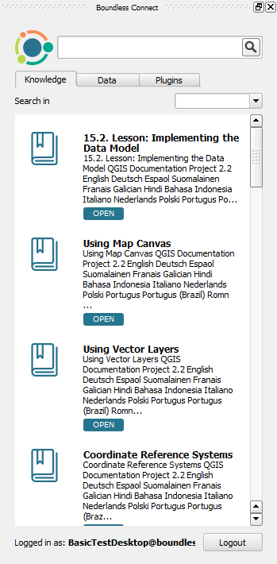
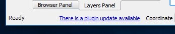

Usage
=====

.. _connect-tool:

Boundless Connect Panel
-----------------------

The :guilabel:`Boundless Connect` panel will automatically open when |BLQGIS|'s QGIS is started for the first time.

.. figure:: img/connect-dock.png
   :align: center

   Boundless Connect Panel with Login

.. note::

   If at the time, you don't want to enter your credentials and search for Boundless Connect resources, you can safely close it. You can open it again later clicking :menuselection:`Plugins --> Boundless Connect` or :menuselection:`View --> Panels --> Plugins --> Boundless Connect` menu items.

.. _connect-login:

Boundless Connect Login
.......................

If you want to install Boundless plugins from the remote *Boundless QGIS Plugin Repository* or search and access `Boundless Connect <https://connect.boundlessgeo.com/>`_ additional resources, you will need to enter `Boundless Connect <https://connect.boundlessgeo.com/>`_ credentials in the :guilabel:`email` and :guilabel:`password` fields, and press :guilabel:`Login`.

After pressing the :guilabel:`Login` button, |connect_plugin| will try to validate your credentials in Boundless Connect portal (internet connection is needed).
If the credentials are valid, it will save them in QGIS's authentication encrypted database, so that you don't have to enter them again.

.. note::

   If you haven't done this before, QGIS will ask you to set a **master password**.
   The *master password* is used to protect all your credentials inside QGIS,
   for example, usernames and passwords for connecting to spatial databases. Choose
   your master password wisely and make sure you memorize it, as **the master
   password is not retrievable**. Press :guilabel:`OK` to complete the process.

   .. figure:: img/add-master-password.png
      :align: center

      Setting QGIS master authentication password

   If you already have a master password, you will be asked to enter it to be able to unlock
   QGIS's authentication database and save your *Boundless Connect* credentials in it.

   .. figure:: img/enter-master-password.png
      :align: center

      Entering QGIS master authentication password

If the credentials are invalid (unknown email or wrong password), you will see
a message dialog, asking you what to do.

* Press :guilabel:`No` to enter valid credentials and try again
* Press :guilabel:`Yes` to use/save the invalid credentials

.. figure:: img/invalid-credentials.png
   :align: center

   Message about invalid credentials

You can also skip entering your credentials, by pressing :guilabel:`Login` without filling the :guilabel:`Email` and :guilabel:`Password` fields.

.. note::

   Even with no credentials or invalid ones, you will be able to use |connect_plugin| and even
   perform a search in the Boundless Connect portal. You will also be able to download plugins
   and other resources that don't require authentication. But, if you try to download protected
   plugins or access resources behind authentication, you will be asked for valid credentials.

If |BLQGIS| was configured to use a local directory-based repository (check this with your system administrator), you can leave
:guilabel:`Email` and :guilabel:`Password` fields empty. Press :guilabel:`Login` to continue. (In this case, you won't be asked for a master password.)

Searching plugins and other resources
.....................................

After the login (either by entering your credentials or skipping it), the :guilabel:`Boundless Connect` panel will show a :guilabel:`Search text` field which can be used to search for Boundless plugins and other additional content.

   Boundless Connect Search

Under the search field there is a dropdown list with all available content categories where you can select content categories in which you are interested. Note that "All" category includes all other categories, so if you select it, there is no need in selecting anything else.

At the bottom of the search panel, you can find the user's email you have logged with and a :guilabel:`Logout` button (clicking the :guilabel:`Logout` button will return you to the login page where you can enter new credentials).

To search for plugins or other resources, type some text in the field and click :guilabel:`Search` (or press :kbd:`Enter` on your keyboard).

.. figure:: img/search-results.png
   :align: center

   Search results

Each item of the search results will show a title and a description about it. There is also tags to inform the type of resources found. Depending on the type of resource, clicking on the item title will perform a different action. For items tagged as plugins, it will download and install the plugin. For other resources, like online content, it will open it in the default web browser.

You will notice the grayed items with red tags. Those mean your subscription level is lower than it's required for accessing that resource, clicking it will point you to the subscription page in Boundless Connect, where you can upgrade your subscription.

.. note::

   You can also install Boundless plugins in the usual way by opening QGIS *Plugin Manager* from :menuselection:`Plugins --> Manage and install plugins` and entering "Boundless" in the filter field in the top of the *Plugin Manager* dialog.

.. _install-plugins:

Plugins installation
--------------------

Using |connect_plugin|, two extra plugin sources can be used besides the usual online remote repository. Therefore, depending on your configuration you can install plugins in several different ways:

* :ref:`from-remote-repository`
* :ref:`from-local-repository` (available with |connect_plugin| only)
* :ref:`from-zip-package` (available with |connect_plugin| only)

.. _from-remote-repository:

From a remote plugin repository
...............................

This is the most common way to install plugins, whether from QGIS's Official Plugins Repository, Boundless QGIS Plugins Repository or any other remote repository that you may have configured, using QGIS's *Plugin Manager* directly in :menuselection:`Plugins --> Manage and Install Plugins...`

In the particular case of the remote *Boundless QGIS Plugin Repository*, it will be necessary to provide credentials to fully access the repository. Therefore, make sure to login as described in :ref:`connect-login`. These can also be set manually in QGIS *Plugin Manager* settings.

For more information on how to use *Plugin Manager*, please refer to the following tutorial on `Working with QGIS plugins <https://learning-center.boundlessgeo.com/desktop/quickstart/working_with_qgis_plugins/index.html>`_.

For more information on *Boundless QGIS Plugin Repository*, please see its `documentation <https://connect.boundlessgeo.com/docs/desktop/latest/plugins/plugin_repo.html>`_

.. _from-local-repository:

From a local repository
.......................

Using |connect_plugin|, it's possible to use a local path or network path as a repository (see :ref:`configure-repository-location` section for details on how to set a local repository). This can be useful in cases of limited or inexistent internet access or to provide a curated list of plugins for your company.

If any repository was set that way, the |connect_plugin| will add an additional menu item in :menuselection:`Plugins` named :guilabel:`Manage plugins (local folder)`. This tool should be used when the user wants to install plugins from a local (directory-based) repository. The usage is similar to the *Plugin Manager*.

To activate, deactivate or uninstall plugins from a local repository, either the *Plugin Manager* or the *Manage plugins (local folder)* tool can be used.

.. Note::

   Since the QGIS *Plugin Manager* does not support directory-based repositories yet, when you uninstall a plugin, previously installed from the local directory-based repository, the following warning will be shown.

   .. figure:: img/plugin-uninstall.png
      :align: center

   This warning can be safely ignored, as you can install or uninstalled the plugin again using :menuselection:`Plugins --> Manage plugins (local folder)` menu item.

.. _from-zip-package:

From a plugin ZIP package
.........................

If you have a plugin package (e.g. previously downloaded from any repository or GitHub) you can easily install it using the |connect_plugin|, without the need to unpack it. Go to :menuselection:`Plugins --> Install plugin from ZIP`, browse to the directory with plugin zip package and select the corresponding file. If the zip file is a valid QGIS plugin package it will be installed and activated.

To deactivate or remove plugins installed this way, like before, one can use QGIS *Plugin Manager* from :menuselection:`Plugins --> Manage and Install Plugins...` menu item.

.. _managing-plugins:

Managing plugins
----------------

All plugins added by |connect_plugin| can be deactivated, uninstalled or updated using QGIS *Plugin Manager*. You can access it via the :menuselection:`Plugins --> Manage and Install Plugins...` menu item.

.. figure:: img/managing-plugins.png
   :align: center

   Plugin Manager

Beside the plugins installed by the user, if previously configured by the system administrator, |connect_plugin| will install additional predefined plugins (see :ref:`add-additional-plugins` section for more details about it).

.. _updating-plugins:

Updating plugins
----------------

By default, |connect_plugin| configure QGIS to check plugin updates every month. This check performed on QGIS start, and if updates found, you will see a corresponding message in QGIS status bar:

   Plugin update available

Clicking this message will open QGIS *Plugin Manager*, where you can select which plugins to update.

.. note::

   When the *Check for updates* is activated, you will be requested to enter your master password after QGIS start. This is necessary to provide the credentials to check updates in *Boundless Plugins Repository*.

If you don't want to be notified about plugin updates or want to check for updates more frequently, open *Plugin Manager* from
:menuselection:`Plugins --> Manage and Install Plugins...` menu, go to the :guilabel:`Settings` tab and edit options.

.. figure:: img/check-updates.png
   :align: center

   Configuring check for updates
